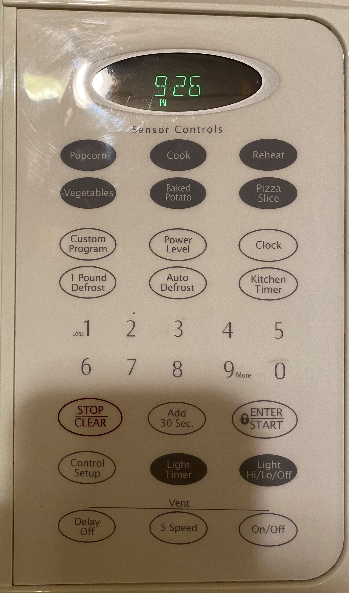
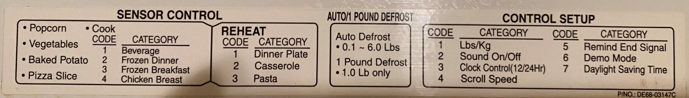
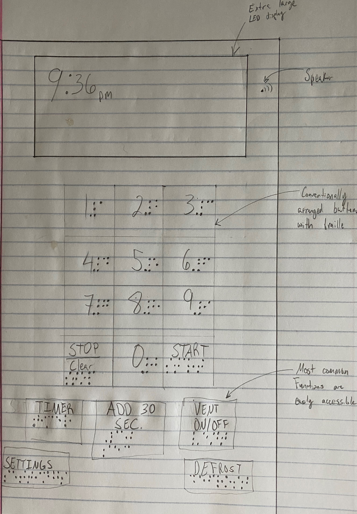

# Improved Microwave - CS 4331 - Project 1

## Old Interface

# In Operation

# Some Issues
Starting from the top, the 14-segment LED display is very limited in the amount of information that can be displayed to the user. When using certain functions that require multiple button presses, the user has to wait for the display to scroll through several menu options. The display also does not tell the user what the options are for some functions, like the reheat function for example. 

The options are displayed on a sticker that is visible when the door is open, but a first time user might not think they would have to open the door in order to learn how to operate the microwave.

The microwave will also start without asking the user for any confirmation of their choice. There is no way to go back to the selection menu, say by pressing the "Stop" button, if the user accidentally chooses the wrong option. 

This interface has a total of 31 buttons, only about half of them are used frequently. Notice the 6 darker buttons just under the display marked "Sensor Controls". The microwave will detect the steam emitted by the food and will automatically adjust the cooking time. No one in the house has ever used these buttons - except the "popcorn" button, which undercooks the popcorn and does not allow the user to add anymore cook time. 

The custom button has no explanation unless the owner's manual is present, which isn't very likely as this microwave came with the house and no one knows where it is. 

The button layout is serviceable but is unconventional at best. If some of the more unnecessary buttons were removed, a more widely used pattern of having 3 columns could be used.

The "Light Timer" and "Light Hi/Lo/Off" have never worked and no one is sure if they are referring to the light on the inside of the microwave or a light underneath the machine. "Light Timer" also brings up a very confusing menu that is difficult to navigate.

The vent is necessary as this microwave is above a stove/oven, but the 5 speeds seems like overkill. 

# Common and Rare Uses
## Common
1. Defrosting chicken
2. Heating up food for a specific time
3. Adding 30 seconds to cook time
4. Using the vent while cooking on the stove
5. Kitchen timer

## Rare
1. Pizza Slice button
2. Baked Potato button
3. Vegetable button
4. Custom Program
5. Cook button
6. Reheat button
7. Light
8. Changing the speed of the vent

This interface makes the common uses fairly easy except the defrosting. The menu that appears when I select defrost is very cumbersome and required a lot of trial and error to get right. The extra buttons can be confusing to a new user.

# User Interactions
I would believe that the most common sequence of actions a user does while using a microwave is:
1. Open the door
2. Place food in
3. Close door
4. Enter desired amount of cook time
5. Hit Start
6. Wait for timer to go off or hit "Add 30 Seconds" to add more cook time

The interface does an okay job at helping the user figure out to make the microwave work, provided that the user has at least some prior knowledge of microwaves as there are no step-by-step instructions on the machine. The only feedback that the user has is the 14-segment display, that can show a total of 7 characters at once, other small LEDs that light up cut-outs, and an audible beep every time a button is pressed and when cook/kitchen timer time is done. The beep can be turned off if the user chooses by going through the "Control Setup" menu.

# Common Mistakes

The most common mistake a user can make is to use the "Sensor Controls" to cook their food as it consistently undercooks their food. As mentioned before, a sensor inside the microwave will detect the amount of steam being emitted by the cooking food and will stop the cooking time when a certain humidity threshold is reached. These controls most likely work, but only for a small percentage of food as it is difficult to account for the wide variety of popcorn, pizza, and vegetables. 

I also remember pressing the "Clock" button instead of the "Kitchen Timer" button a few times by mistake when first using the microwave. Keep in mind, I was in my early teens and generally inexperienced when it comes to using a microwave, but I still believe it is a valid point as this could be someone's first microwave and accidentally changing the microwaves clock instead of starting a countdown timer could be dangerous. If they needed a timer for say, cooking a pizza in the oven, there is potential for the user to forget about the pizza and could start a fire.

This might be too specific, but my grandfather did live with use for a time and he had difficulty using the microwave as he was legally blind. The interface is completely smooth, and the beeping only confirmed he pressed a button, not which button he is pressing. We added some glue dots to a couple buttons, like the "Start", "Stop", and the "3" button to help him get his bearings on the machine, but he often needed help from someone with vision to operate the microwave.

# Suggestions

My suggestions would be:
1. Remove the Sensor Controls and Light Controls
2. Arrange the numbers in more conventional pattern that resembles a phone interface
3. Simplify the vent controls
4. Add some texture to the interface for the visually impaired
5. Add Read-out function that tells the user what they're pressing, replacing the beep
6. Higher quality display
7. Add the "Clock" button to the "Control Setup" menu

# New Interface

For my new interface, I got rid of the Sensor Control buttons and used the space for an extra-large LCD display. A speaker is also added to speak out commands if text-to-speak is enabled, otherwise the classic beep will play. The 0-9, start, and stop buttons are arranged in a more conventional way and braille is embossed to help the visually impaired. In a final design, the braille would be underneath the numbers instead of next to them like they are in the diagram, it is just difficult to clearly see the braille and numbers on a sketch. The vent controls have been massively simplified, with only one speed and a toggle button. The "Clock" button has been removed and moved to the "Settings" menu, which has replaced the vaguely named "Control Setup" button. The "Add 30 Sec." button has been placed directly underneath the numbers as it is most likely the most pressed button after the numbers.

Since the "Control Sensor" buttons are removed and the LCD display is capable of showing much more information, the menu on the inside of the microwave can be completely removed.

Points on diagram, from top to bottom, read:
1. Extra large LCD display
2. Speaker
3. Conventionally arranged buttons with braille
4. Most common functions are easily accessible
